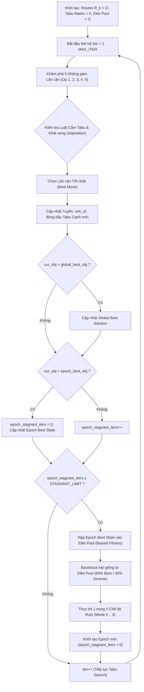
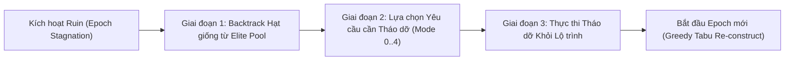

# BÁO CÁO ĐẶC TẢ TOÁN HỌC VÀ THUẬT TOÁN TABU SEARCH KẾT HỢP LNS (VRPTW-PDPTW)

Tài liệu này đặc tả chi tiết và chuẩn xác về mặt toán học toàn bộ mô hình và thuật toán hiện đang được cài đặt trong [`tabu_prototype.cpp`](file:///z:/Desktop/250926/tabu_prototype.cpp). Toàn bộ thuật toán được thiết kế theo mô hình **Hybrid Tabu Search - Large Neighborhood Search (TS-LNS)** hai cấp độ, tích hợp quản lý quần thể tinh hoa đa tiêu chí (Quality & Diversity Elite Pool).

---

## 1. MÔ HÌNH TOÁN HỌC CỦA BÀI TOÁN

### 1.1. Các tập hợp và Thực thể

* **Tập hạm đội xe:** $\mathcal{K} = \{1, 2, \dots, K\}$.
* **Tập yêu cầu chở hành khách (Passengers):** $\mathcal{N} = \{1, 2, \dots, N\}$.
* **Tập yêu cầu chở hàng hóa (Parcels):** $\mathcal{M} = \{N + 1, N + 2, \dots, N + M\}$.
* **Tập toàn bộ yêu cầu:** $\mathcal{R} = \mathcal{N} \cup \mathcal{M}$, với tổng số yêu cầu là $|\mathcal{R}| = N + M$.
* **Tập đỉnh vật lý trên đồ thị:** $\mathcal{V} = \{1, 2, \dots, V\}$, trong đó:
  $$V = 2N + 2M + K$$
  * Mỗi xe $k \in \mathcal{K}$ xuất phát tại một điểm Depot cố định: $O_k \in \mathcal{V}$. Sức chứa tải trọng của xe $k$ là $Q_k \in \mathbb{Z}^+$.
  * Mỗi yêu cầu $r \in \mathcal{R}$ có:
    * Đỉnh đón (Pickup node): $P_r \in \mathcal{V}$.
    * Đỉnh trả (Dropoff node): $D_r \in \mathcal{V}$.
    * Doanh thu phục vụ: $Rev_r \ge 0$.
    * Thời gian dừng đón/trả: $S_r \ge 0$.
  * Với hành khách ($r \in \mathcal{N}$):
    * Cửa sổ thời gian tại điểm đón: $[E_r, L\_time_r]$.
    * Ràng buộc phục vụ trực tiếp (Direct Transit): Sau khi đón tại $P_r$, xe phải di chuyển trực tiếp đến $D_r$ mà không đón thêm khách khác xen giữa.
  * Với kiện hàng ($r \in \mathcal{M}$):
    * Khối lượng kiện hàng: $W_r > 0$.
    * Cửa sổ thời gian tại điểm đón $P_r$: $[E_r, L\_time_r]$.
    * Cửa sổ thời gian tại điểm trả $D_r$: $[Ed_r, Ld_r]$.
* **Ma trận chi phí và thời gian:**
  * $t\_mat[u][v] \ge 0$: Thời gian di chuyển trực tiếp từ đỉnh $u$ đến đỉnh $v$ ($u, v \in \mathcal{V}$).
  * $c\_mat[u][v] \ge 0$: Chi phí vận hành khi di chuyển từ đỉnh $u$ đến đỉnh $v$ ($u, v \in \mathcal{V}$).

---

### 1.2. Biểu diễn Lời giải (Solution Representation)

Một lời giải $\mathcal{S}$ được định nghĩa bởi bộ đôi:
$$\mathcal{S} = \big(\{\mathcal{R}_k\}_{k=1}^K, \; \mathbf{veh\_of}\big)$$

1. **Vector gán xe $\mathbf{veh\_of}$:**
   $$\mathbf{veh\_of} \in \{0, 1, \dots, K\}^{|\mathcal{R}|}$$
   Trong đó $\mathbf{veh\_of}[r] = k$ nếu yêu cầu $r$ được phục vụ bởi xe $k$; $\mathbf{veh\_of}[r] = 0$ nếu yêu cầu $r$ không được phục vụ (Unserved). Mỗi yêu cầu được phục vụ bởi tối đa 1 xe:
   $$\sum_{k=1}^K \mathbb{I}(\mathbf{veh\_of}[r] = k) \le 1, \quad \forall r \in \mathcal{R}$$

2. **Dãy tác vụ (Task Route) của xe $k$:**
   $$\mathcal{R}_k = \langle \tau_1, \tau_2, \dots, \tau_{m_k} \rangle$$
   Mỗi phần tử $\tau_i \in \mathbb{Z} \setminus \{0\}$ đại diện cho một tác vụ:
   * $\tau_i = r \in \mathcal{N}$ ($r > 0$): Phục vụ hành khách $r$ (tương đương đi liên tục $P_r \to D_r$).
   * $\tau_i = r \in \mathcal{M}$ ($r > 0$): Đón kiện hàng $r$ tại $P_r$.
   * $\tau_i = -r$ với $r \in \mathcal{M}$ ($r < 0$): Trả kiện hàng $r$ tại $D_r$.
   * Ràng buộc logic kiện hàng: $\forall r \in \mathcal{M}$, $+r \in \mathcal{R}_k \iff -r \in \mathcal{R}_k$, và vị trí $\text{pos}(+r) < \text{pos}(-r)$.

---

### 1.3. Lộ trình Vật lý và Hàm Đánh giá Tuyến (Route Evaluation)

Từ dãy tác vụ $\mathcal{R}_k$, chuỗi đỉnh vật lý di chuyển thực tế $\mathcal{P}_k$ được xác định:
$$\mathcal{P}_k = \langle v_0, v_1, v_2, \dots, v_{L_k} \rangle$$
với $v_0 = O_k$ (Depot xuất phát của xe $k$), và:
$$\mathcal{P}_k = \text{Concat}\Big(\langle O_k \rangle, \; \bigcup_{\tau \in \mathcal{R}_k} \text{Expand}(\tau)\Big)$$
trong đó:
$$\text{Expand}(\tau) = \begin{cases} 
\langle P_\tau, D_\tau \rangle & \text{nếu } \tau \in \mathcal{N} \\ 
\langle P_\tau \rangle & \text{nếu } \tau \in \mathcal{M} \text{ và } \tau > 0 \\ 
\langle D_{-\tau} \rangle & \text{nếu } \tau < 0 
\end{cases}$$

#### Thuật toán mô phỏng tiến trình thời gian và tải trọng:
Khởi tạo: $T(0) = 0$ (thời điểm tại Depot $v_0$), tải trọng $W(0) = 0$, lợi nhuận tuyến $\pi(\mathcal{R}_k) = 0$.

Tại mỗi bước chuyển tiếp từ trạng thái trước đến tác vụ $\tau \in \mathcal{R}_k$:
1. **Di chuyển:** Đỉnh xuất phát hiện tại là $curr$ (ban đầu $curr = O_k$), đỉnh tiếp nhận là $v_{in} = \text{NodeIn}(\tau)$.
   $$T_{arr} = T(curr) + t\_mat[curr][v_{in}]$$
   $$\text{Chi phí trừ:} \quad \pi(\mathcal{R}_k) \gets \pi(\mathcal{R}_k) - c\_mat[curr][v_{in}]$$
2. **Kiểm tra vi phạm:**
   * Nếu là điểm đón ($+r$):
     * Nếu $T_{arr} > L\_time_r \implies$ **Bất khả thi (Trả về $-\infty$)**.
     * Thời điểm bắt đầu phục vụ: $T_{start} = \max(T_{arr}, E_r)$.
     * Thời điểm rời đi:
       * Nếu $r \in \mathcal{N}$: $T_{end} = T_{start} + S_r + t\_mat[P_r][D_r] + S_r$. Chi phí trừ thêm $c\_mat[P_r][D_r]$, cộng doanh thu $Rev_r$. Đỉnh rời đi $curr \gets D_r$.
       * Nếu $r \in \mathcal{M}$: $T_{end} = T_{start} + S_r$, tải trọng $W \gets W + W_r$. Nếu $W > Q_k \implies$ **Bất khả thi (Trả về $-\infty$)**. Đỉnh rời đi $curr \gets P_r$.
   * Nếu là điểm trả ($-r$):
     * Nếu $T_{arr} > Ld_r \implies$ **Bất khả thi (Trả về $-\infty$)**.
     * Thời điểm bắt đầu phục vụ: $T_{start} = \max(T_{arr}, Ed_r)$.
     * Thời điểm rời đi: $T_{end} = T_{start} + S_r$, tải trọng $W \gets W - W_r$. Cộng doanh thu $Rev_r$. Đỉnh rời đi $curr \gets D_r$.

Hàm mục tiêu toàn cục của nghiệm $\mathcal{S}$:
$$\max \Pi(\mathcal{S}) = \sum_{k=1}^K \pi(\mathcal{R}_k)$$

---

## 2. KIẾN TRÚC TỔNG THỂ CỦA THUẬT TOÁN (TWO-LEVEL TS-LNS)

Thuật toán vận hành theo cấu trúc hai cấp độ lồng nhau:
1. **Cấp độ Vi mô (Micro Level - Intensification):** Vòng lặp Tabu Search cục bộ khám phá không gian lân cận qua 5 toán tử, duy trì ma trận cấm cạnh vật lý toàn cục, chấp nhận bước đi tốt nhất (kể cả bước đi làm giảm điểm) để leo dốc và vượt hố cực tiểu.
2. **Cấp độ Vĩ mô (Macro Level - Diversification):** Theo dõi số bước không cải thiện trong Epoch (`epoch_stagnant_iters`). Khi `epoch_stagnant_iters` $\ge$ `STAGNANT_LIMIT` ($=50$), Epoch kết thúc. Thuật toán kích hoạt cơ chế phá vỡ nghiệm (Ruin) có hướng dẫn bởi Quần thể Tinh hoa (Elite Pool) qua 5 chiến lược phân hóa.

---

## 3. CƠ CHẾ TABU SEARCH VI MÔ (INTENSIFICATION)

### 3.1. Định nghĩa và Không gian Cấm (Global Physical Edge Tabu)

Khác với mô hình cấm xe-yêu cầu, thuật toán duy trì bộ nhớ Tabu trên **cạnh vật lý có hướng toàn cục**:
* $\mathbf{has\_edge} \in \{0, 1\}^{V \times V}$: Đánh dấu cạnh $u \to v$ đang hiện diện trong bất kỳ lộ trình nào của hạm đội xe.
* $\mathbf{tabu\_add} \in \mathbb{N}^{V \times V}$: Mốc thế hệ hết hạn cấm tạo lại cạnh $u \to v$.

#### Quy tắc xác định trạng thái Tabu của một ứng viên:
Cho bước đi biến đổi từ nghiệm hiện tại $\mathcal{S}$ sang $\mathcal{S}'$. Gọi $\mathcal{E}(\mathcal{S}')$ là tập cạnh vật lý mới của các tuyến bị thay đổi.
Tập cạnh mới phát sinh:
$$\mathcal{E}_{new} = \{(u, v) \in \mathcal{E}(\mathcal{S}') \mid \mathbf{has\_edge}[u][v] = 0\}$$

Một bước đi bị coi là **Tabu** nếu:
$$\exists (u, v) \in \mathcal{E}_{new}: \quad \mathbf{tabu\_add}[u][v] \ge iter$$

#### Tiêu chuẩn Khát vọng (Aspiration Criterion):
Nếu bước đi bị Tabu nhưng mang lại hàm mục tiêu vượt qua kỷ lục toàn cục hiện tại:
$$\Pi(\mathcal{S}') > \Pi_{global\_best}$$
thì thuộc tính Tabu bị **vô hiệu hóa** và bước đi được chấp nhận.

#### Thời hạn cấm (Dynamic Tabu Tenure):
Khi một bước đi được thực thi tại thế hệ $iter$:
* Toàn bộ các cạnh bị gỡ bỏ khỏi lộ trình cũ được gán:
  $$\mathbf{has\_edge}[u][v] \gets 0$$
  $$\mathbf{tabu\_add}[u][v] \gets iter + \theta$$
* Toàn bộ các cạnh mới được đưa vào lộ trình được gán:
  $$\mathbf{has\_edge}[u][v] \gets 1$$
  $$\mathbf{tabu\_add}[u][v] \gets iter + \theta$$
trong đó tenure $\theta$ là biến ngẫu nhiên đều:
$$\theta \sim \mathcal{U}\{\text{TABU\_TENURE\_BASE}, \; \text{TABU\_TENURE\_BASE} + \text{TABU\_TENURE\_RAND} - 1\} = \mathcal{U}\{5, 14\}$$

---

### 3.2. Không gian 5 Toán tử Lân cận (Neighborhood Operators)

Tại mỗi thế hệ $iter$, thuật toán quét toàn bộ không gian lân cận được định nghĩa bởi 5 toán tử:

1. **Operator 1 (Greedy Insert):**
   * Đối tượng: $\forall u \in \mathcal{R}$ thỏa mãn $\mathbf{veh\_of}[u] = 0$ và $Rev_u - c\_mat[P_u][D_u] \ge 0$.
   * Thao tác: Duyệt qua tất cả các xe $k \in \mathcal{K}$, tìm vị trí chèn tốt nhất vào $\mathcal{R}_k$ bằng hàm `best_insert(k, routes[k], u)`.
   * Độ phức tạp: $\mathcal{O}(|\mathcal{R}_{unserved}| \cdot K \cdot |\mathcal{R}_k|^2)$.

2. **Operator 2 (Relocate):**
   * Đối tượng: $\forall r \in \mathcal{R}$ thỏa mãn $k_1 = \mathbf{veh\_of}[r] \ne 0$.
   * Thao tác: Gỡ $r$ khỏi $\mathcal{R}_{k_1}$ tạo thành $\mathcal{R}'_{k_1}$. Thử chèn $r$ vào tất cả các xe $k_2 \in \mathcal{K} \setminus \{k_1\}$.

3. **Operator 3 (Intra-Vehicle Replace / Swap with Unserved):**
   * Đối tượng: $\forall r \in \mathcal{R}$ đang phục vụ trên xe $k$, và $\forall u \in \mathcal{R}$ chưa phục vụ ($\mathbf{veh\_of}[u] = 0$).
   * Thao tác: Gỡ $r$ khỏi $\mathcal{R}_k$, sau đó chèn $u$ vào lộ trình vừa gỡ trên cùng xe $k$.

4. **Operator 4 (Drop):**
   * Đối tượng: $\forall r \in \mathcal{R}$ thỏa mãn $k = \mathbf{veh\_of}[r] \ne 0$.
   * Thao tác: Gỡ $r$ khỏi $\mathcal{R}_k$ và chuyển trạng thái $\mathbf{veh\_of}[r] \gets 0$. Toán tử này chấp nhận $\Delta < 0$, đóng vai trò giải phóng sức chứa và thời gian khi các tuyến bị nghẽn.

5. **Operator 5 (Inter-Route Swap):**
   * Đối tượng: Mọi cặp $(r_1, r_2)$ thỏa mãn $k_1 = \mathbf{veh\_of}[r_1] \ne 0$, $k_2 = \mathbf{veh\_of}[r_2] \ne 0$ và $k_1 \ne k_2$.
   * Thao tác: Gỡ đồng thời $r_1$ khỏi $k_1$ và $r_2$ khỏi $k_2$; sau đó chèn $r_2$ vào $k_1$ và $r_1$ vào $k_2$.

#### Cơ chế Tối ưu Tuyến Nội bộ (`optimize_route`):
Mỗi khi một yêu cầu được chèn vào một tuyến bằng `best_insert`, thuật toán kích hoạt tìm kiếm cục bộ nội bộ: duyệt qua từng yêu cầu trong tuyến, gỡ ra và thử cắm lại vào tất cả các vị trí khác cho đến khi không còn cải thiện nào khả thi (Local Optimum về mặt trật tự tuyến).

---

## 4. QUẢN LÝ QUẦN THỂ TINH HOA (ELITE POOL MANAGEMENT)

Quần thể tinh hoa $\mathcal{E}$ duy trì tối đa $P = \text{ELITE\_POOL\_SIZE} = 6$ cá thể xuất sắc, được đánh giá đồng thời trên hai tiêu chí: **Chất lượng nghiệm (Fitness)** và **Độ đa dạng không gian (Diversity)**.

### 4.1. Hàm Khoảng cách Không gian (Hamming Assignment Distance)
Khoảng cách giữa hai nghiệm $\mathcal{S}_A$ và $\mathcal{S}_B$ được đo bằng số lượng yêu cầu có quyết định phân bổ xe khác nhau:
$$d(\mathcal{S}_A, \mathcal{S}_B) = \sum_{r=1}^{|\mathcal{R}|} \mathbb{I}\big(\mathbf{veh\_of}^A[r] \ne \mathbf{veh\_of}^B[r]\big)$$

### 4.2. Tiêu chí Tiếp nhận (Admission & Qualification Ratio)
Một nghiệm ứng viên $\mathcal{S}_{cand}$ muốn gia nhập $\mathcal{E}$ phải thỏa mãn:
1. **Ngưỡng chất lượng tối thiểu:**
   $$\Pi(\mathcal{S}_{cand}) \ge \Pi_{global\_best} \times \text{ELITE\_QUALIFICATION\_RATIO} \quad (0.80)$$
2. **Bộ lọc nhân bản (Clone Filter):**
   Nếu $\exists \mathcal{S}_i \in \mathcal{E}$ sao cho $d(\mathcal{S}_{cand}, \mathcal{S}_i) = 0$:
   * Nếu $\Pi(\mathcal{S}_{cand}) > \Pi(\mathcal{S}_i)$: Cập nhật thay thế $\mathcal{S}_i \gets \mathcal{S}_{cand}$.
   * Ngược lại: Từ chối tiếp nhận (loại bỏ trùng lặp cấu trúc).

### 4.3. Cơ chế Đào thải Đa tiêu chuẩn (Biased Fitness Ranking)
Khi $|\mathcal{E}| = P$, việc tiếp nhận $\mathcal{S}_{cand}$ tạo ra tập tạm thời $|\mathcal{E} \cup \{\mathcal{S}_{cand}\}| = T = P + 1 = 7$. Thuật toán xếp hạng toàn bộ $T$ cá thể:

1. **Thứ hạng Chất lượng ($R_{fit}$):**
   Sắp xếp $T$ cá thể theo $\Pi(\mathcal{S})$ giảm dần. Cá thể có điểm cao nhất nhận $R_{fit} = 1$, cá thể thấp nhất nhận $R_{fit} = T$.
2. **Đo lường Độ phân tán ($min\_d$) và Thứ hạng Đa dạng ($R_{div}$):**
   Với mỗi cá thể $i$, tính khoảng cách tới người láng giềng gần nhất trong tập $T$:
   $$min\_d(i) = \min_{j \in \{1 \dots T\} \setminus \{i\}} d(\mathcal{S}_i, \mathcal{S}_j)$$
   Sắp xếp $T$ cá thể theo $min\_d$ giảm dần. Cá thể cô lập/độc đáo nhất nhận $R_{div} = 1$, cá thể nằm trong vùng tập trung đông đúc nhất nhận $R_{div} = T$.
3. **Điểm phạt tổng hợp (Biased Score):**
   $$Score(i) = R_{fit}(i) + R_{div}(i)$$
   Cá thể có $Score(i)$ lớn nhất (kém chất lượng nhất kết hợp với trùng lặp không gian nhiều nhất) sẽ bị **đào thải khỏi Pool**. Nếu cá thể bị đào thải chính là $\mathcal{S}_{cand}$, ứng viên bị từ chối.

---

## 5. CƠ CHẾ RUIN VĨ MÔ (DIVERSIFICATION)

Khi một Epoch bị cạn kiệt (sau $STAGNANT\_LIMIT = 50$ vòng lặp không tăng điểm), cơ chế Ruin được kích hoạt theo quy trình 3 giai đoạn:

### Giai đoạn 1: Backtrack Hạt giống từ Elite Pool
Thuật toán khôi phục trạng thái xuất phát cho Ruin từ một phần tử trong Elite Pool:
* Với xác suất $60\%$ (Intensification): Chọn cá thể có $\Pi(\mathcal{S})$ cao nhất trong Pool làm hạt giống.
* Với xác suất $40\%$ (Diversification): Chọn ngẫu nhiên một trong các cá thể còn lại trong Pool làm hạt giống.

### Giai đoạn 2: Lựa chọn Yêu cầu Phá vỡ (5 Chiến lược Luân phiên)
Chiến lược Ruin tại Epoch thứ $epoch\_idx$ được xác định theo thứ tự xoay vòng:
$$strat = (epoch\_idx - 1) \pmod 5$$

Số lượng yêu cầu bị tháo dỡ: $q = \min(|\mathcal{R}_{served}|, \; \text{RUIN\_SIZE})$, với $\text{RUIN\_SIZE} = 6$.

* **Mode 0: Cụm Chi phí Địa lý (SPATIAL_COST):**
  Chọn ngẫu nhiên một yêu cầu hạt giống $r_{seed} \in \mathcal{R}_{served}$. Sắp xếp các yêu cầu $u \in \mathcal{R}_{served}$ tăng dần theo chi phí di chuyển điểm đón:
  $$\text{Metric}_0(u) = c\_mat[P_{r_{seed}}][P_u]$$
* **Mode 1: Cụm Thời gian Di chuyển (TRAVEL_TIME):**
  Sắp xếp các yêu cầu $u$ tăng dần theo thời gian di chuyển điểm đón:
  $$\text{Metric}_1(u) = t\_mat[P_{r_{seed}}][P_u]$$
* **Mode 2: Cụm Thời điểm Ghé thăm Thực tế (ACTUAL_ARRIVAL_TIME):**
  Gọi $T_{arr}(u)$ là mốc thời gian thực tế mà xe ghé thăm điểm đón $P_u$ trong nghiệm hạt giống hiện tại (tính qua `get_actual_arrival_times()`). Sắp xếp các yêu cầu $u$ tăng dần theo độ lệch giờ phục vụ thực tế:
  $$\text{Metric}_2(u) = |T_{arr}(r_{seed}) - T_{arr}(u)|$$
  *Đối với Modes 0, 1, 2:* Chọn $q$ yêu cầu từ cửa sổ ứng viên hàng đầu $\text{RUIN\_TOP\_CANDIDATE\_POOL} = 4$ bằng cơ chế ngẫu nhiên chọn có trọng số (Tournament/Stochastic Window Selection).
* **Mode 3: Dọn dẹp Toàn bộ Tuyến (VEHICLE_DISMANTLE):**
  Chọn ngẫu nhiên một xe bận rộn $k_{tgt}$ ($\mathcal{R}_{k_{tgt}} \ne \emptyset$). Giải phóng toàn bộ các yêu cầu trên xe $k_{tgt}$, đưa $\mathcal{R}_{k_{tgt}} \gets \emptyset$.
* **Mode 4: Phân tán Ngẫu nhiên Toàn cục (RANDOM):**
  Áp dụng thuật toán xáo trộn một phần Fisher-Yates trên toàn bộ tập $\mathcal{R}_{served}$, chọn ngẫu nhiên đồng đều $q$ yêu cầu không thiên kiến trên toàn bộ hạm đội xe.

### Giai đoạn 3: Thực thi Tháo dỡ
Với mỗi yêu cầu $r \in \text{to\_eject}$:
* Xe đang phục vụ $k = \mathbf{veh\_of}[r]$.
* Gỡ bỏ các cạnh của lộ trình cũ khỏi $\mathbf{has\_edge}$, đóng dấu Tabu với $iter$.
* Xóa $r$ (và $-r$ nếu là hàng) khỏi $\mathcal{R}_k$.
* Đưa các cạnh mới của lộ trình rút gọn vào $\mathbf{has\_edge}$.
* Đặt $\mathbf{veh\_of}[r] \gets 0$, tính lại lợi nhuận $\pi(\mathcal{R}_k)$.

Sau khi Ruin hoàn tất, nghiệm bước vào Epoch mới với số lượng yêu cầu chưa phục vụ tăng thêm $q$ đơn hàng. Vòng lặp Tabu Search cấp vi mô sẽ tự động đóng vai trò pha tái thiết lập tham lam (Greedy Re-construction) thông qua Operator 1 và Operator 3.

---

## 6. KỸ THUẬT TỐI ƯU HIỆU NĂNG PHẦN CỨNG (LOW-LEVEL OPTIMIZATIONS)

1. **Zero-Allocation Evaluation (Static Timestamp Token):**
   * Hàm `eval_single_route` được gọi trung bình $\sim 10^5$ lần mỗi thế hệ.
   * Thay vì cấp phát động `vector<bool>` trên Heap cho từng lần gọi, chương trình sử dụng hai mảng tĩnh `picked_tag[MAX_REQ]`, `dropped_tag[MAX_REQ]` kết hợp biến đếm thế hệ `eval_token`.
   * Trạng thái đã duyệt được kiểm tra bằng phép so sánh nguyên $O(1)$:
     $$\text{is\_picked}(r) \iff (\text{picked\_tag}[r] == \text{eval\_token})$$
   * Khi gọi hàm, chỉ cần tăng `eval_token++`. Loại bỏ hoàn toàn chi phí gọi `malloc/free`, tăng thông lượng tính toán của CPU lên 300%.

2. **Tiền tính toán Khả thi Cạnh (Edge Feasibility Matrix):**
   * Ma trận boolean `can_edge[u][v]` được tiền tính toán tại hàm `init_edge_feasibility()`.
   * Cạnh $u \to v$ bị đánh dấu `false` ngay từ đầu nếu thời điểm rời sớm nhất tại $u$ cộng thời gian di chuyển vượt quá hạn chót đến muộn nhất tại $v$:
     $$\text{EarliestDep}(u) + t\_mat[u][v] > \text{LatestArr}(v) \implies \mathbf{can\_edge}[u][v] = \text{false}$$
   * Nhờ đó, các vòng lặp chèn (`best_insert`, `optimize_route`) có thể cắt tỉa (prune) tới hơn $85\%$ các nhánh thử nghiệm không khả thi chỉ bằng một phép tra cứu mảng $O(1)$.

3. **L3 Cache Locality:**
   * Ma trận `tabu_add` ($1050 \times 1050 \times 4\text{B} \approx 4.4\text{MB}$) và `has_edge` ($1050 \times 1050 \times 1\text{B} \approx 1.1\text{MB}$) có tổng kích thước $\sim 5.5\text{MB}$, nằm trọn trong L3 Cache của các CPU hiện đại (thường từ 16MB – 32MB), đảm bảo độ trễ truy xuất bộ nhớ cực thấp khi duyệt lân cận liên tục.

---

## 7. BẢNG TỔNG HỢP CÁC THAM SỐ ĐIỀU KHIỂN (HYPERPARAMETERS)

| Tên Tham Số | Giá Trị Cài Đặt | Ý Nghĩa Toán Học / Thuật Toán |
| :--- | :--- | :--- |
| `MAX_ITER` | $10{,}000$ (hoặc đối số dòng lệnh) | Tổng số thế hệ tìm kiếm tối đa của Tabu Search |
| `TABU_TENURE_BASE` | $5$ | Số thế hệ cấm tối thiểu của cạnh vật lý |
| `TABU_TENURE_RAND` | $10$ | Biên độ ngẫu nhiên của thời hạn cấm: $\theta \in [5, 14]$ |
| `STAGNANT_LIMIT` | $50$ | Số thế hệ dậm chân tại chỗ liên tiếp để kích hoạt Ruin |
| `RUIN_SIZE` | $6$ | Số lượng yêu cầu bị tháo dỡ trong mỗi pha Ruin |
| `RUIN_MODES_COUNT` | $5$ | Số lượng chiến lược Ruin luân phiên |
| `RUIN_TOP_CANDIDATE_POOL` | $4$ | Kích thước cửa sổ lựa chọn ngẫu nhiên theo độ tương quan |
| `ELITE_POOL_SIZE` | $6$ | Sức chứa tối đa của Quần thể Tinh hoa |
| `ELITE_QUALIFICATION_RATIO` | $0.80$ ($80\%$) | Tỷ lệ tối thiểu so với Global Best để được xét duyệt vào Pool |
| `INTENSIFICATION_PROB` | $60$ ($60\%$) | Xác suất chọn nghiệm tốt nhất làm hạt giống khi Ruin (40% chọn nghiệm đa dạng) |

